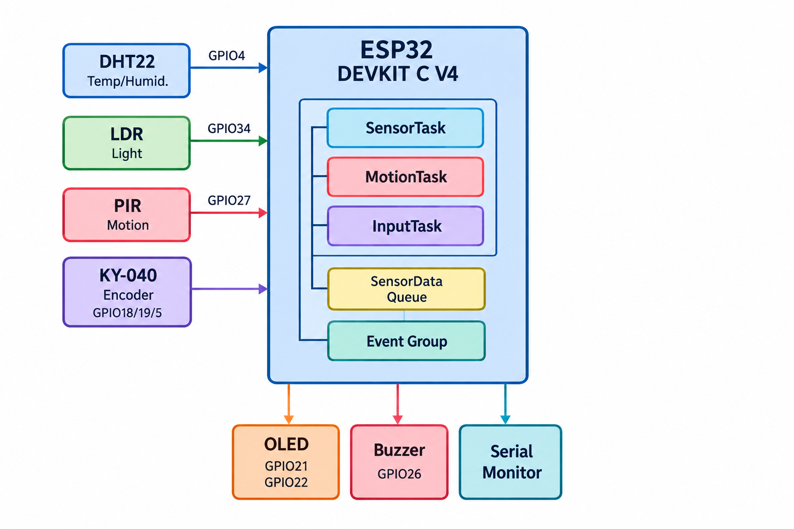
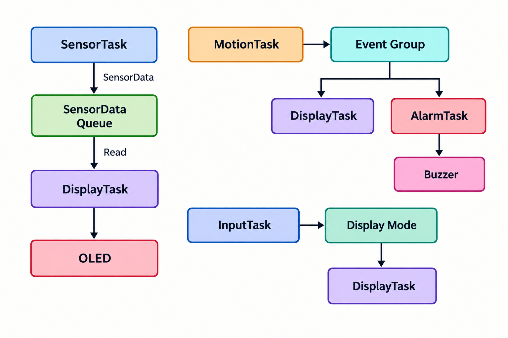
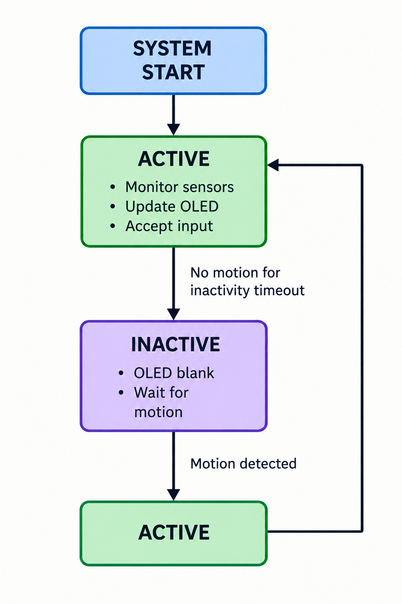
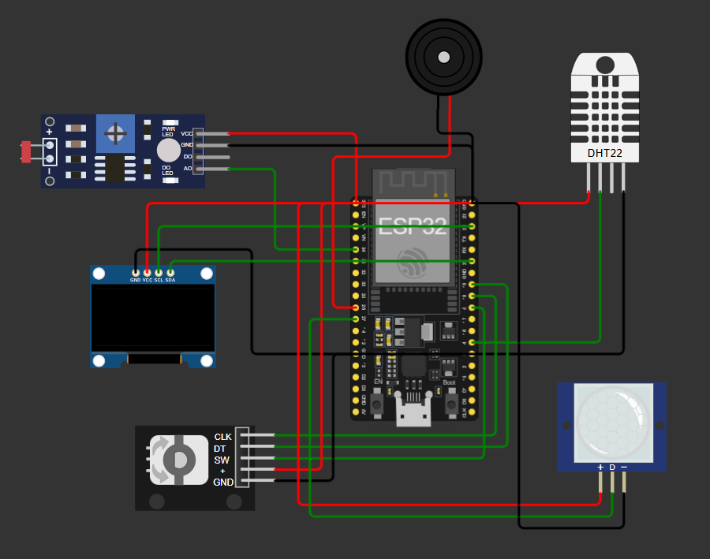
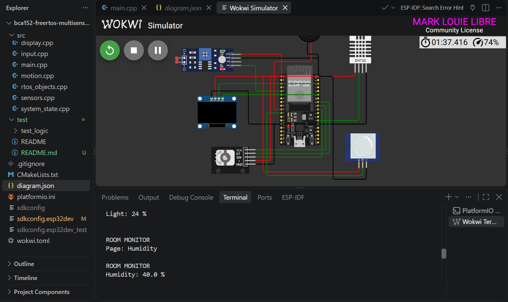

# BCA152 FreeRTOS Multi-Sensor Room Monitor

## Project Overview

This project is an ESP32-based room monitoring system developed using **ESP-IDF**, **FreeRTOS**, **PlatformIO**, and **Wokwi**. It monitors temperature, humidity, ambient light, and motion while demonstrating multitasking, queues, event groups, mutex synchronization, and a finite state machine.

## Features

* Real-time temperature and humidity monitoring (DHT22)
* Ambient light sensing (LDR)
* PIR motion detection
* SSD1306 OLED display
* Rotary encoder menu navigation
* High-temperature buzzer alarm
* ACTIVE/INACTIVE system state management
* FreeRTOS queue, mutex, and event group communication

## Learning Objectives

* Apply FreeRTOS multitasking
* Implement inter-task communication
* Design an embedded state machine
* Perform unit testing and static analysis
* Develop and verify an ESP32 application in Wokwi

## System Architecture

> **Figure 1. Overall system architecture**



Sensors provide data to the ESP32, which processes the information using multiple FreeRTOS tasks before displaying the results on the OLED and activating the alarm when necessary.

## FreeRTOS Architecture

> **Figure 2. FreeRTOS task communication**



## Hardware / Simulated Components

| Component       | Purpose                |
| --------------- | ---------------------- |
| ESP32 DevKit V4 | Main controller        |
| DHT22           | Temperature & humidity |
| LDR             | Light measurement      |
| PIR Sensor      | Motion detection       |
| SSD1306 OLED    | Display                |
| KY-040 Encoder  | Navigation             |
| Buzzer          | Alarm                  |

## Pin Configuration

| Device      | GPIO |
| ----------- | ---: |
| DHT22       |    4 |
| OLED SDA    |   21 |
| OLED SCL    |   22 |
| LDR         |   34 |
| PIR         |   27 |
| Encoder CLK |   18 |
| Encoder DT  |   19 |
| Encoder SW  |    5 |
| Buzzer      |   26 |

## Task Design

| Task        | Priority | Function         |
| ----------- | -------: | ---------------- |
| SensorTask  |        2 | Read DHT22 & LDR |
| DisplayTask |        1 | Update OLED      |
| InputTask   |        3 | Read encoder     |
| MotionTask  |        3 | Detect motion    |
| AlarmTask   |        2 | Control buzzer   |

## Inter-Task Communication

* **Queue:** Transfers the latest sensor data from `SensorTask` to `DisplayTask`.
* **Event Group:** Controls ACTIVE and ALARM states.
* **Mutex:** Prevents overlapping Serial Monitor output.

## State Machine

> **Figure 3. ACTIVE/INACTIVE state machine**



* **ACTIVE:** Sensors and display operate normally.
* **INACTIVE:** Display is blank after inactivity timeout.
* Motion returns the system to ACTIVE.

## Repository Structure

```text
bca152-freertos-multisensor/
├── include/
├── src/
├── test/
├── docs/
│   └── images/
├── diagram.json
├── platformio.ini
└── README.md
```

## Getting Started

### Requirements

* VS Code
* PlatformIO
* Wokwi Extension

Clone the repository and open it in VS Code.

## Building the Project

```bash
pio run -e esp32dev
```

## Running the Wokwi Simulation

1. Build the project.
2. Open Wokwi.
3. Start the simulation.
4. Change sensor values and observe the OLED and Serial Monitor.

> **Figure 4. Wokwi circuit**



## Unit Testing

Run the native tests:

```bash
pio test -e native
```

Implemented tests include:

* Temperature alarm logic
* Display navigation
* System state transitions

## Static Code Analysis

Run Cppcheck:

```bash
pio check
```

The project produced only low-severity style findings related to RTOS task entry functions.

## Functional Verification

All required functional tests (FT-01 to FT-10) were verified in the Wokwi simulation, including sensor updates, encoder navigation, motion detection, alarm behavior, and state transitions.

> **Figure 5. Finished system**



## Engineering Decisions

FreeRTOS was used to separate sensing, display, input, motion, and alarm processing into independent tasks. Queues provide safe data transfer, event groups manage system states, and mutexes synchronize shared serial output.

## Limitations

* Designed for Wokwi simulation.
* Alarm currently monitors temperature only.
* No persistent data logging.

## Future Improvements

* Wi-Fi monitoring dashboard
* Cloud or SD card data logging
* Configurable alarm thresholds
* Automatic OLED brightness control

## References and Acknowledgments

* ESP-IDF Documentation
* FreeRTOS Documentation
* PlatformIO Documentation
* Wokwi Simulator
* FoxKeys DHT-ESP-IDF Library
